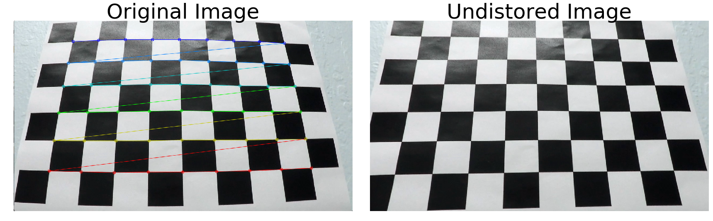
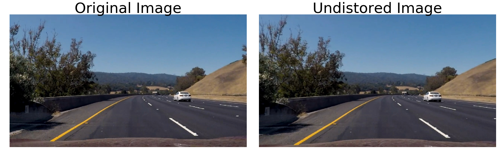
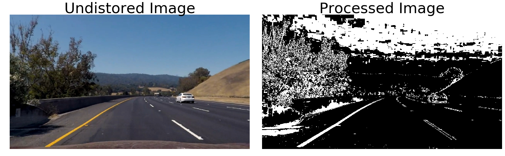
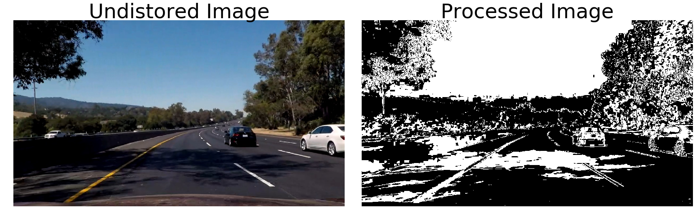
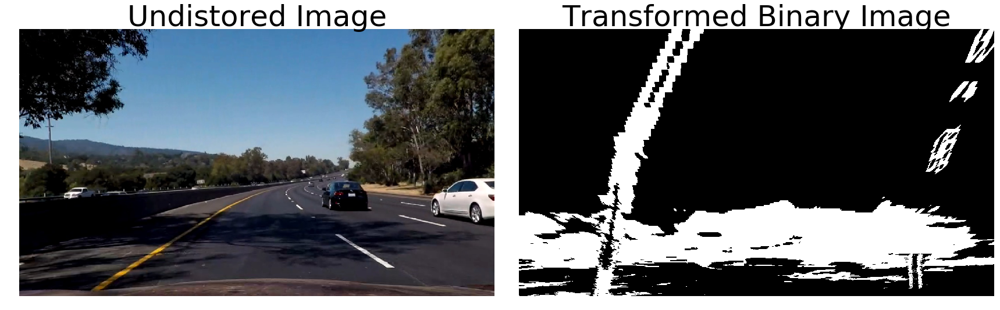
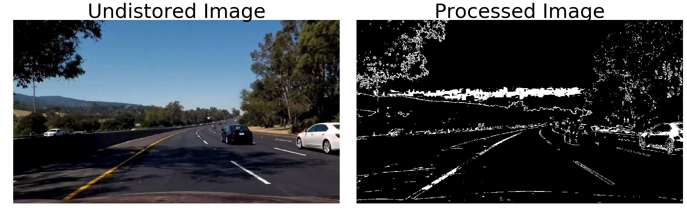
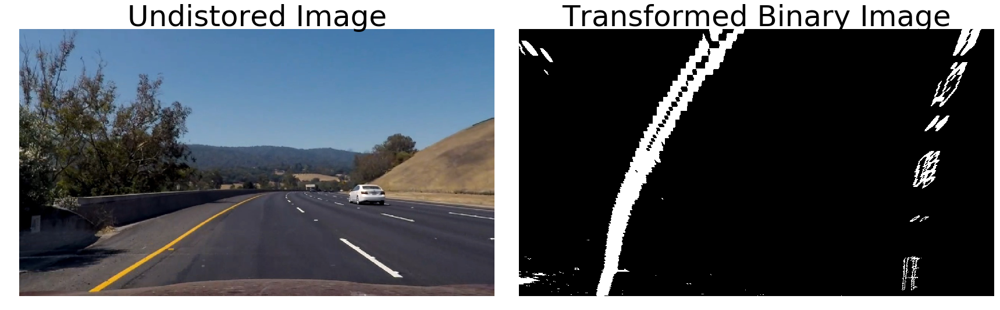
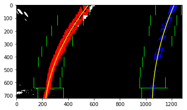
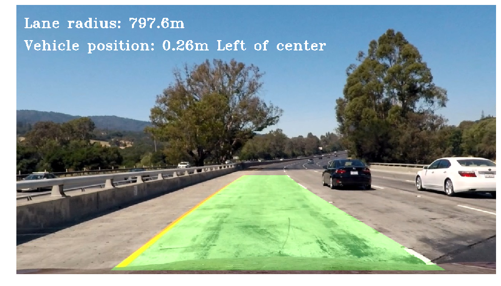

# Udacity Self Driving Car Nanondegree

## Project 4: Advanced Lane Finding

The goals / steps of this project are the following:

* Compute the camera calibration matrix and distortion coefficients given a set of chessboard images.
* Apply a distortion correction to raw images.
* Use color transforms, gradients, etc., to create a thresholded binary image.
* Apply a perspective transform to rectify binary image ("birds-eye view").
* Detect lane pixels and fit to find the lane boundary.
* Determine the curvature of the lane and vehicle position with respect to center.
* Warp the detected lane boundaries back onto the original image.
* Output visual display of the lane boundaries and numerical estimation of lane curvature and vehicle position.

## Project Structure

This project is self-contained in the single Jupyter Notebook file, [LaneFinding.ipynb](LaneFinding.ipynb).

## Final results

<a href="https://youtu.be/JxopSjc3BHo" target="_blank">
  
</a>

## Camera Calibration

Camera calibration was performed using the standard chessboard images which were provided in 
[the Udacity Github](https://github.com/udacity/CarND-Advanced-Lane-Lines/tree/master/camera_cal) 
repo for this project.

Stepping through each image I used the `cv2.findChessboardCorners` method which can be found in the
second cell of the Notebook. If corners were found for a particular images I kept track of the
object points corresponding image points.  In this case `objp` (object points) are the `x, y, z`
coordinates of the image which don't change from image to images (since we assume all images are of
the same size).  `imgpoints` is a list/array of `x, y` coordinates for the image corners which will
vary from image to image and corner to corner.  Both of these lists of coordinates are saved as
global variables and used to undistort camera images from the car.

To actually perform the undistortion I created a small helper function named `cal_undistort` in the
first cell. This is really a light wrapper around the `cv2.calibrateCamera()` and `cv2.undistort()` functions.

Below is a single example image with an original image (with the found corners overlayed) and
resulting undistorted image.



As a sanity check I applied the undistortion to one of the sample images from the freeway and
obtained the following which looks accurate:




## Pipeline (single images)

### Thresholding using color transformations and gradients

The next step was creating a pipeline which takes an undistorted image as input and returns a
binary/thresholded image as output.  This first iteration of my code can be seen in the `pipeline` command.
While this version worked fairly well it one main problem where dark shadows across the road were
being picked up as "good" pixels and threw off the polyfit.

The original steps ere:

- Convert the image to `HLS` color space and extract the `S` channel. The `S` channel was chosen
  because it does the best job of clearly identifying lanes
- Create a binary image where pixels are kept if they are within my thresholded values of `(95,
  255]`
- Create an other image by applying a Sobel filter in the x direction, making sure to normalize the
  results
- Again, create a binary image where pixels are kept if they are within my thresholded values of
  `[20, 100]`. These values seemed to keep the features I was interested in and kept a minimal
  amount of noise.
- Finally, create a final binary image which is effectively a union of the two images where pixels
  are "on" for either one of the two images.

An example is which worked well is shown below:



An example is which *didn't* work well is shown below. The problem was the large shadow cast across
the middle the lane:



After transforming to a top-down image that shadow created a large "on" spot at the bottom of the
image:



To fix this, I updated the thresholding to look at five different calculated attributes:

- S channel in HLS color space
- R channel in RGB
- Sobel operator in:
    - x and y direction
    - gradient direction
    - gradient magnitude

The final binary image is created using a set of boolean operations where the following conditions
are `OR`ed together:

- S `AND` R channel 
- SobelX `AND` SobelX channel 
- SobelGradient `AND` SobelDirection channel 

All of this logic may be seen in `LaneLineDetector.threshold`

Comparing the results before and after the change in algorithm shows a clear improvement:





### Creating bird's eye view of lanes

Code for this can be seen in the notebook "Apply a perspective transform..."

To determine which starting points to use for the creation of a bird's eye view I eyeballed a few
points on the image:

```
src = np.float32([
    [265, 685], # bottom left
    [586, 455], # top left
    [698, 455], # top right
    [1055, 685], # bottom right
])
```

Placing these points on the image itself looked like this...you can see four dots on the lane
lines: two on the bottom of the image and two near the center of the image.

!()[example-images/transform-start-points.png]

After some trial and error, I came to a final set of destination points which produced the final
image below.

```
dst = np.float32([
    [255, h - 10], # bottom left
    [245, 0], # top left
    [1065, 0], # top right
    [1055, h - 10], # bottom right
])
```




### Fitting a polynomial

Using the example code that I worked with in the project I did the work of fitting and visualizing
a polynomial on the lane lines.  This work and code is wrapped up inside the final
`LaneLineDetector` class for clarity.  Below is an image which I produced during the exploration
phase to ensure that the code was working as expected:



The code which does this work can be found in `LaneLineDetector.init_polyfit`, _without_ the code
that actually drew the bounding boxes and polyfit lines since that is extraneous for the final
submission.

The algorithm to detect the lane shape and fit a polynomial consists of:

- Taking a histogram of the bottom half of the image and find the "peaks" for both left and right
  sides. The assumption here is that the "on" pixels will be clumped together representing the lane
  lines
- Using a pre-defined bounding box side and number of iterations, walk up the image and recenter
  the windows on their respective new "peaks"...taking the mean `x` value as the center of the
  lane/bounding box. Save the `x, y` indices for all of the "on" pixels in these windows. This 
- Using all of the "on" `x, y` indices get the corresponding coordinates and fit a second-order
  polynomial
- At each iteration, I add the best fit x values to a 10-element `deque` and take the average
  values as the true measure/fit.

After this is done for the first time, subsequent iterations will take shorter approach since the
sliding window method had already found the starting point for the lanes lines.  In
`LaneLineDetector.find_next_polyfit` the work of finding the non-zero pixels is done again but
without the sliding window process and _with_ a small margin.

Previous I did not use the averaging technique...adding that adding a lot of stability to the
movement of my detected lane borders.

### Calculating radius of curvature

The radius is calculated in `LaneLineDetector.calculate_radius`. Given a an image I fit a new
polynomial in real-world space where "real-world" really means "meters per pixel". These are
calculated based on the standard size of a highway lane:

```
ym_per_pix = 30 / 720 # meters per pixel in y dimension
xm_per_pix = 3.7 / 700 # meters per pixel in x dimension
```

The polyfit works because we already have the `x, y` coordinates of the lane, so this step is
simply a matter of doing the same math with a different scale.

After the polyfit occurs and we have our new constants we can use them to calculate curvature using
the final equation discussed in the project description. Python implementation for that equation,
where `self._y_eval` is just `height - 1` and `l1, l2, l3` are the constant terms from our
polynomial:

```
left_curved =  ((1 + (2 * l1 * self._y_eval * ym_per_pix + l2)**2)**1.5) / np.absolute(2 * l1)
```

As with the x-values for the curve fitting, I calculated an average radius using the last 10
measurements. To report a *final* radius I then take and average between the right and left values.


### Calculating offset from center

I calculated the car's position with respect to center in the
`LaneLineDetector.calculate_car_position` method.  The process here is quite simple since we
already have an equation to calculate the `x` location for a given `y` input.  Here, `y` is the
bottom of the image or the actual height of the image.

- Calculate the left and right `x` positions for max `y` value using our already-calculated
  polynomial. This is the bottom of the image and
  denotes the left and right boundary of the lanes immediately in front of the car.
- Determine the lane width by taking a difference between the right and left `x` locations
- Calculate the lane center by adding `lane_width / 2` to the left `x` position
- If lane center is greater than `image_width / 2` the car is to the left of center, and vice
  versa.
- Finally apply the same "meters per pixel" conversion to the pixel offset from center

Offset also uses the averaging technique as explained in the polynomial fitting and radius
sections.

### Drawing lane area on image

In `LaneLineDetector.draw_region` I create a new image to draw the lane line fits and shape. Much
of this is `numpy` array wrangling to build up the new image.

Towards the end of this function I use the `cv2.warpPerspective` function again but this time apply
an inverse transformation.  This takes us from the bird's eye view perspective back into the
"normal" perspective which is simply the original.


### Final test

I have a single method, `LaneLineDetector.process` which can operate on a single image and output a
final image.  I used this on multiple test images to ensure that it was working properly. Once I
was happy with the output I ran the video file through this same function to get the final output
video.

An example output image from one of the test input images is shown below.




## Discussion

Overall I think this code performed fairly well.  Previously I had some jitter in the calculation for
the radius and offset.  Using the averaging technique for curve fitting, radius and offset helped
significantly. 

I also saw a huge improvement when adding in the sobel thresholding techniques for direction and
magnitude. This makes sense, especially for direction since lane lines (when driving straight)
should almost always be pointing in an expected direction. Adding this made a huge difference by
*not* picking up the shadows across the road.
